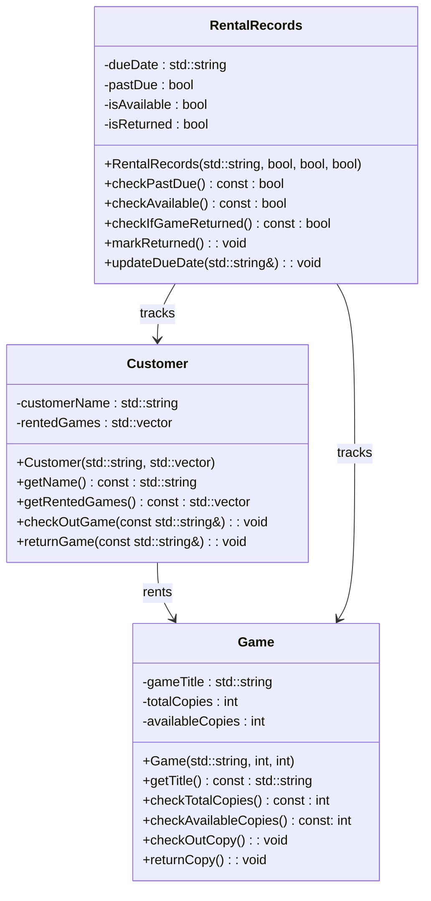

# Part 1: Program Specification
This program mocks a games renting system. It allows the user to view if a
specific game is available, and if the game is available, it allows the user to
see how many copies of the game are available. Customers can rent available games
and the program keeps track of which games have been rented, which games are available,
which games are out of stock and when games are due, along with keeping track of past due games.
The entities involved are games, customers and rental records.

# Part 2: List of nouns and verbs
* Nouns(classes):
    * Game
    * Customer
    * Rental records
    * Title
    * Copy
    * Due date
    * Inventory
* Verbs(methods):
    * Return
    * Rent
    * View
    * Check out
    * Track
    * Add
    * Remove
    
# Part 3: Designing 3 classes
```
#include <iostream>
#include <vector>
#include <string>

class Game
{
   private:
        std::string gameTitle;
        int totalCopies;
        int availableCopies;
    public:
        Game(std::string gameTitle, int totalCopies, int availableCopies) : gameTitle(gameTitle), totalCopies(totalCopies), availableCopies(availableCopies) {}
        std::string getTitle() const;
        int checkTotalCopies() const;
        int checkAvailableCopies() const;
        
        void checkOutCopy();
        void returnCopy();
};

class Customer
{
    private:
        std::string customerName;
        std::vector<std::string> rentedGames;
    public:
        Customer(std::string customerName, std::vector<std::string> rentedGames) : customerName(customerName), rentedGames(rentedGames) {}
        
        std::string getName() const;
        std::vector<std::string> getRentedGames() const;
        
        void checkOutGame(const std::string& game);
        void returnGame(const std::string& game);
        
};

class RentalRecords
{
    private:
        std::string dueDate;
        bool pastDue;
        bool isAvailable;
        bool isReturned;
   public:
        RentalRecords(std::string dueDate, bool pastDue, bool isAvailable, bool isReturned) : dueDate(dueDate), pastDue(pastDue), isAvailable(isAvailable), isReturned(isReturned) {}
        
        bool checkPastDue() const;
        bool checkAvailable() const;
        bool checkIfGameReturned() const;
        
        void markReturned();
        void updateDueDate(std::string& dueDate);
};
```
# Part 4: Draw a class diagram using mermaid

