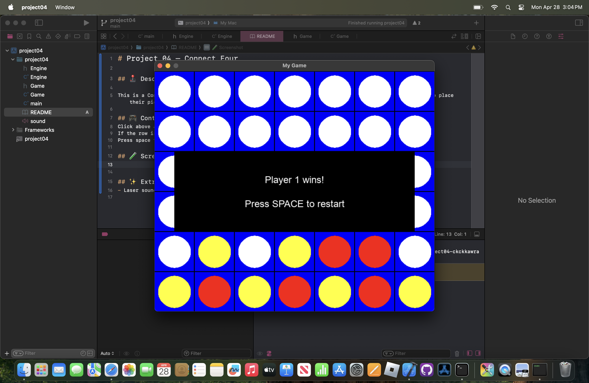

# Project 04 – Connect Four
 
## 🕹️ Description
 
This is a Connect Four game written in C++ using SDL2. Players take turns placing pieces using the mouse to place their piece on a column. If the column is full, users must choose a different column.
 
## 🎮 Controls
Click the column to place your piece
If the column is full, pick a different column to place on
Press space to restart after a winner is determined or after the users draw

## 🧪 Screenshot

 
## ✨ Extra Features
- Laser sound effect when a piece drops
